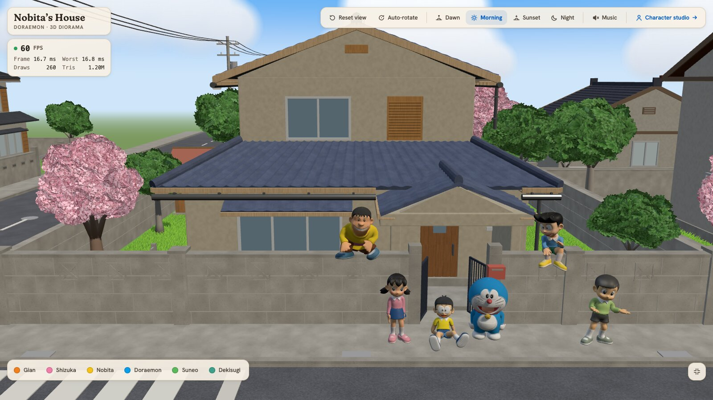
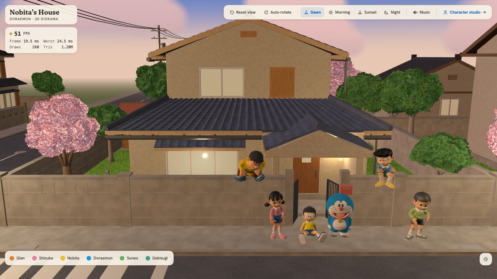
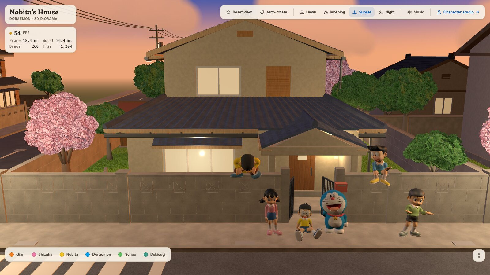
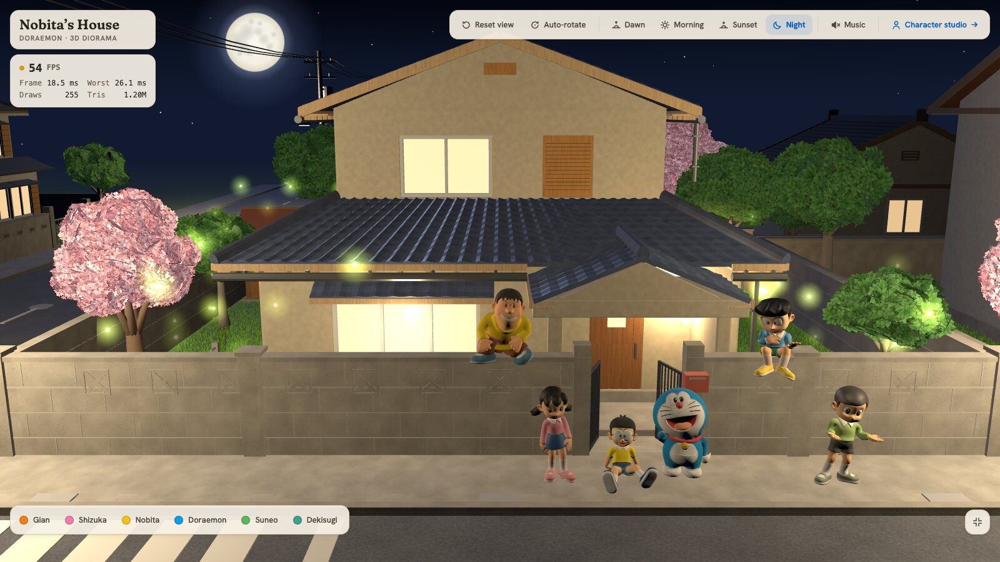
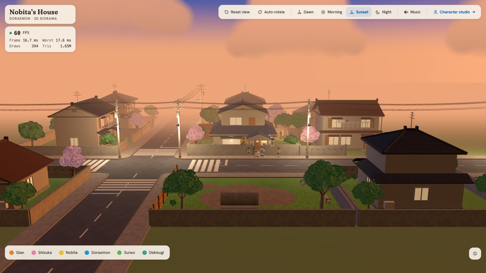
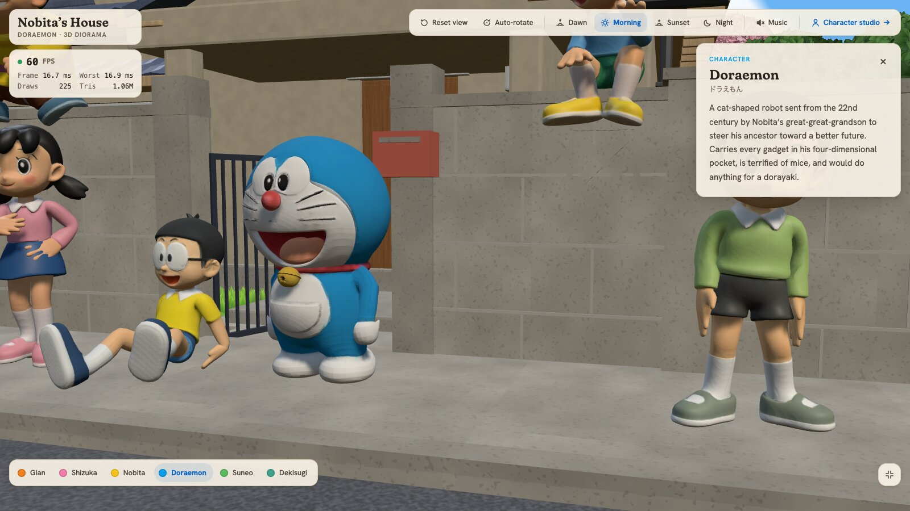
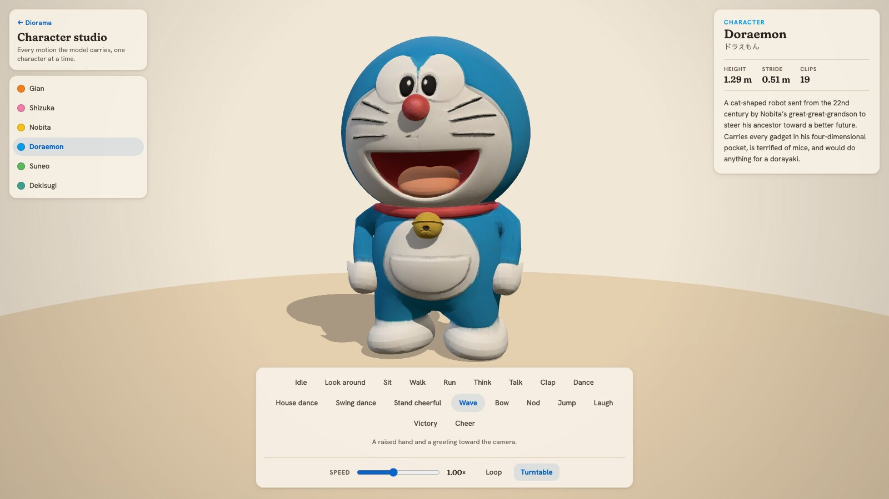

# Nobita's House — a 3D Doraemon diorama

A 3D web diorama of Nobita's house and the Japanese suburb around it, with Doraemon and friends gathered round the front gate. Orbit the block, change the time of day, click a character to meet them, or open the character studio to play every motion they carry.

**Live demo: [nobita-house.vercel.app](https://nobita-house.vercel.app/)**



## Features

- **Explorable neighbourhood.** Nobita's house stands on a crossroads with seven neighbour lots and, across the road, the vacant lot with its three concrete pipes. Drag to orbit, scroll to zoom, pan around the block. The camera stops at the walls instead of passing through houses.
- **Four times of day.** Dawn, morning, sunset and night each change the sky, sun, shadows, fog and clouds. At night the windows and street lamps light up, and there are stars, a moon and fireflies.
- **Six characters.** Doraemon, Nobita, Shizuka, Gian, Suneo and Dekisugi, each rigged and animated. Some sit on the wall, some stand and talk. Click one, or use the roster, and the camera flies over and opens their info card.
- **Character studio.** Put one character on a lit turntable and play any of their clips (idle, walk, run, wave, dance, laugh and more), with speed, loop and turntable controls.
- **Also:** auto-rotate, a reset-view button, background music you can toggle, a live FPS / draw-call / triangle panel, and a phone layout with a settings sheet.

## Screenshots

| Dawn | Sunset |
|---|---|
|  |  |

| Night | The whole block |
|---|---|
|  |  |

| Character card | Character studio |
|---|---|
|  |  |

## Pages

| Route | What it shows |
|---|---|
| `/` | The diorama |
| `/characters/<id>` | The character studio: `doraemon`, `nobita`, `shizuka`, `jaian`, `suneo`, `dekisugi` |

## Tech stack

| Layer | Choice |
|---|---|
| UI | React 19, TypeScript |
| 3D | three.js, @react-three/fiber, @react-three/drei, camera-controls |
| State / animation | zustand, motion |
| Build | Vite, bun |
| Quality | Biome (lint + format), Vitest |
| Hosting | Vercel |

The scene targets 60 FPS on desktop. Current numbers and budgets are in [docs/tech-stack.md](docs/tech-stack.md#measured-performance-m4-chrome-headless-over-cdp-real-metal-gpu-2026-09-11).

## Getting started

Requires [bun](https://bun.sh).

```sh
git clone https://github.com/lnanhkhoa/nobita-house-3d.git
cd nobita-house-3d
bun install
bun run dev        # http://localhost:5173
```

The optimised models in `public/models/` are committed, so the app runs straight after cloning. No environment variables are needed.

| Script | Does |
|---|---|
| `bun run dev` | Start the dev server |
| `bun run build` | Type-check and build to `dist/` |
| `bun run preview` | Serve the production build |
| `bun run lint` | Biome check |
| `bun run typecheck` | TypeScript, no emit |
| `bun run test` | Vitest: scene data, routing, lighting, placement, walk loop, music |

## Project structure

```
src/
  app.tsx          diorama page
  studio/          character studio page
  scene/           house, streets, neighbours, foliage, characters, lighting, camera
  data/            scene layout, characters, animation catalog, time-of-day presets
  state/           zustand stores
  ui/              panels, roster, info card, controls, music
public/models/     optimised GLB models
scripts/           asset pipeline: reference images, Blender builders, GLB optimisation
docs/              tech stack, asset pipeline, design guidelines, deployment
```

## How the models were made

The characters started as reference images, went through image-to-3D on Hyper3D Rodin, were rigged and animated with Mixamo, and were cleaned up in Blender. The house, streets, neighbour lots and plants are built procedurally by Blender Python scripts. Everything is then compressed with gltf-transform (dedup, weld, texture resize, meshopt). The full runbook is in [docs/asset-pipeline.md](docs/asset-pipeline.md).

## Documentation

- [docs/tech-stack.md](docs/tech-stack.md): architecture, conventions, performance
- [docs/asset-pipeline.md](docs/asset-pipeline.md): reference image to GLB
- [docs/design-guidelines.md](docs/design-guidelines.md): visual and UI direction
- [docs/deployment.md](docs/deployment.md): Vercel deploy and rollback

## Disclaimer

This is a non-commercial fan project for personal and portfolio use. Doraemon and all related characters are © Fujiko Pro / Shogakukan / TV Asahi. This project is not affiliated with or endorsed by the rights holders.
